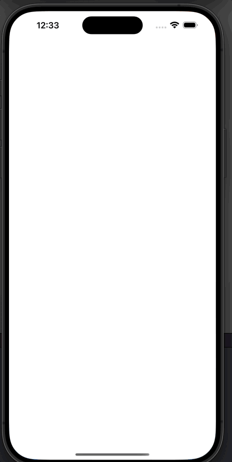

# ravenTestNYT

**RavenTestNYT** is a SwiftUI application designed to fetch and display articles from the New York Times. This project includes networking services, data persistence, and a modular structure following iOS development best practices, with a clear implementation of the **MVVM (Model-View-ViewModel)** architecture.

## Demo



## Table of Contents

1. [Features](#features)
2. [Technologies Used](#technologies-used)
3. [Prerequisites](#prerequisites)
4. [Installation](#installation)
5. [Project Structure](#project-structure)
6. [Usage](#usage)
7. [Testing](#testing)
8. [Contributing](#contributing)
9. [License](#license)

---

## Features

- **API Consumption**: Fetches articles from the New York Times using a REST API.
- **User Interface**: Modern and responsive design with SwiftUI.
- **Data Persistence**: Uses Core Data to store articles locally.
- **Error Handling**: Implements robust error handling in networking services.
- **Unit and UI Testing**: Includes unit tests for ViewModels and services, along with basic UI tests.
- **MVVM Architecture**: Ensures a clean separation of concerns between the UI (View), business logic (ViewModel), and data (Model).

---

## Technologies Used

- **Language**: Swift
- **UI Framework**: SwiftUI
- **Architecture**: MVVM (Model-View-ViewModel)
- **Dependency Management**: Xcode
- **Database**: Core Data
- **Testing**: XCTest

---

## Prerequisites

- macOS with Xcode 14.0 or later installed.
- New York Times API key (you can get one at [developer.nytimes.com](https://developer.nytimes.com/)).

---

## Installation

1. Clone the repository:
   ```bash
   git clone https://github.com/your-username/ravenTestNYT.git
   ```

2. Open the project in Xcode:
   ```bash
   cd ravenTestNYT
   open ravenTestNYT.xcodeproj
   ```

3. Set up your API key in `ArticleService.swift`:
   ```swift
   let apiKey = "YOUR_API_KEY"
   ```

4. Run the application on a simulator or physical device.

---

## Project Structure

```plaintext
ravenTestNYT/
├── Assets.xcassets/              # Graphics and colors
├── Models/                       # Data models (e.g., Article)
├── Views/                        # SwiftUI Views
├── ViewModels/                   # Presentation logic
├── Networking/                   # Networking services
├── Database/                     # Core Data persistence
├── Utilities/                    # Utilities and extensions
├── Tests/                        # Unit tests
└── README.md                     # Project documentation
```

---

## Usage

1. Upon launching the app, it fetches the latest articles from the New York Times API.
2. The articles are displayed in a list, and you can select one to view its details.
3. If offline, the app uses locally stored articles from Core Data.

---

## Testing

The project includes unit tests to ensure code quality:

1. Run all tests:
   ```bash
   cmd + U
   ```

2. Key areas covered:
   - **ViewModels**: `ArticleListViewModelTests.swift`
   - **Networking Services**: `ArticleServiceTests.swift`
   - **Mock Testing**: Simulated data in `Mocks/`

---

## License

This project is licensed under the MIT License. See the `LICENSE` file for details.
